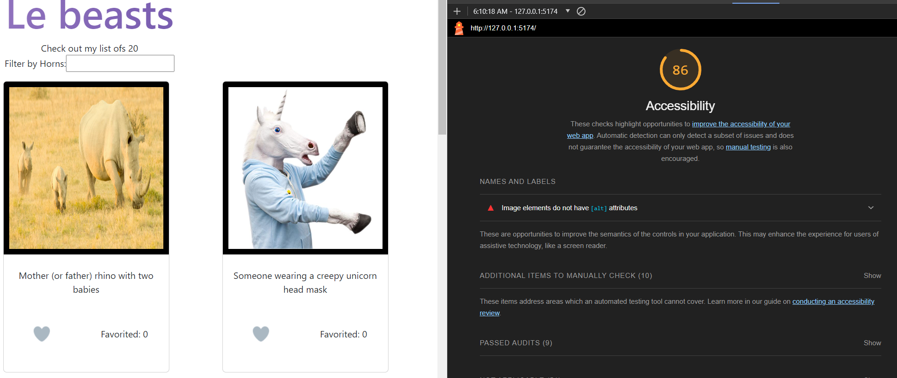

# LAB - 1/2/3/4

HornedBeast

### Author: Felix A. Taveras

### Lighthouse Accessibility Report Score

* 

### Reflections and Comments

* Lots of new things to learn. It seems like after getting the structure right, react will be more natural :D

 Feature #1: Display Images

Estimate of time needed to complete: 30 mins

Finish time: Finished this yesterday on the expected time

Feature #2: Allow users to favorite

Estimate of time needed to complete: 1hr

Took me about 30 mins

Feature #3: Bootstrap

This feature is on the works

Feature #4: Display a Modal

Estimated time to complete 45 mins

Took me about 15 mins

Feature #4: Filter by number of horns

Time estimated: 2h

I am not really sure how much it took me to preogram this, but I had to change the structure of my modules and that took me a great deal of time

