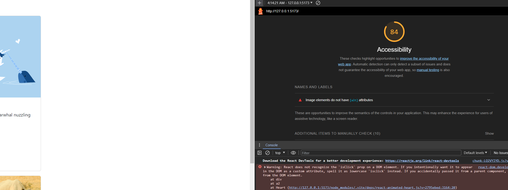

# LAB - 1

Teh beginning of HornedBeast

### Author: Felix A. Taveras

### Lighthouse Accessibility Report Score

* 

### Reflections and Comments

* Lots of new things to learn. It seems like after getting the structure right, react will be more natural :D

Number and name of feature: Feature #1: Display Images

Estimate of time needed to complete: 30 mins

Finish time: Finished this yesterday on the expected time

Number and name of feature: Feature #2: Allow users to favorite

Estimate of time needed to complete: 1hr

Took me about 30 mins

Number and name of feature: Feature #3: Bootstrap

This feature is on the works